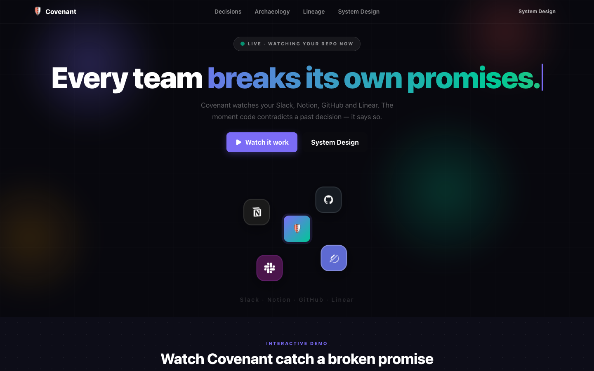
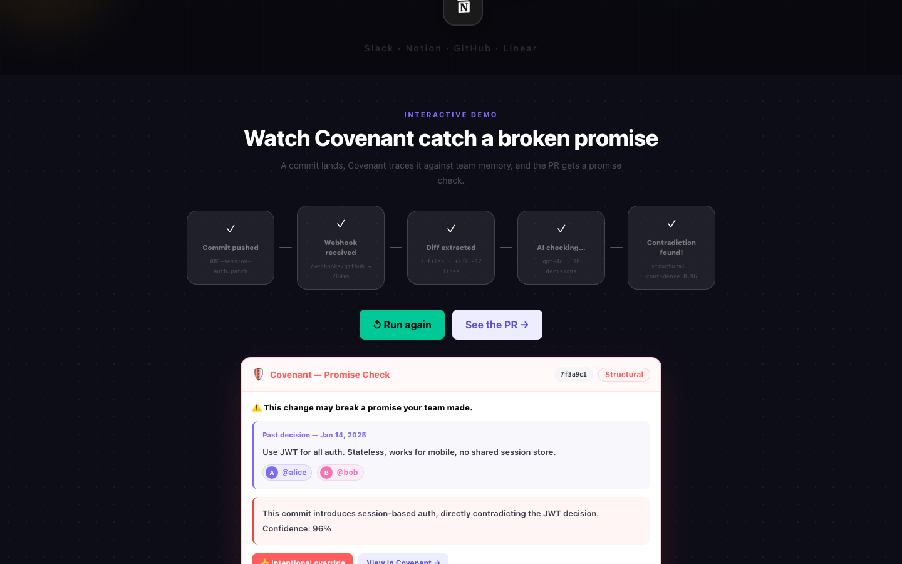
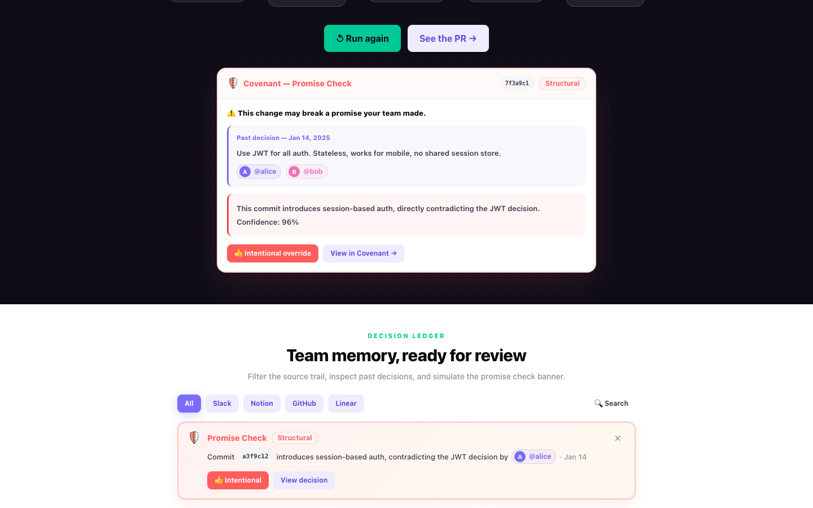
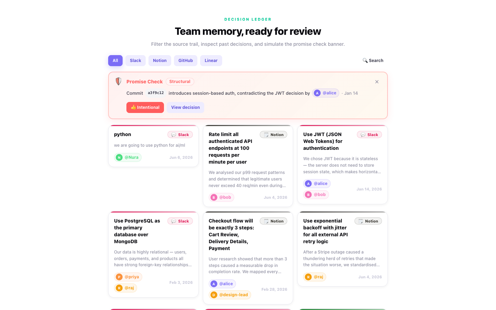
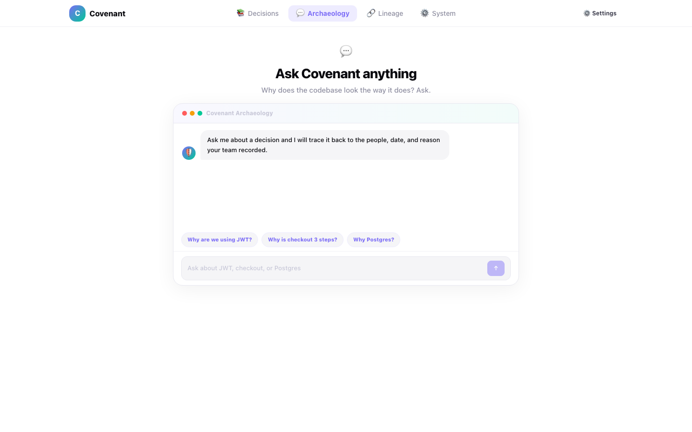
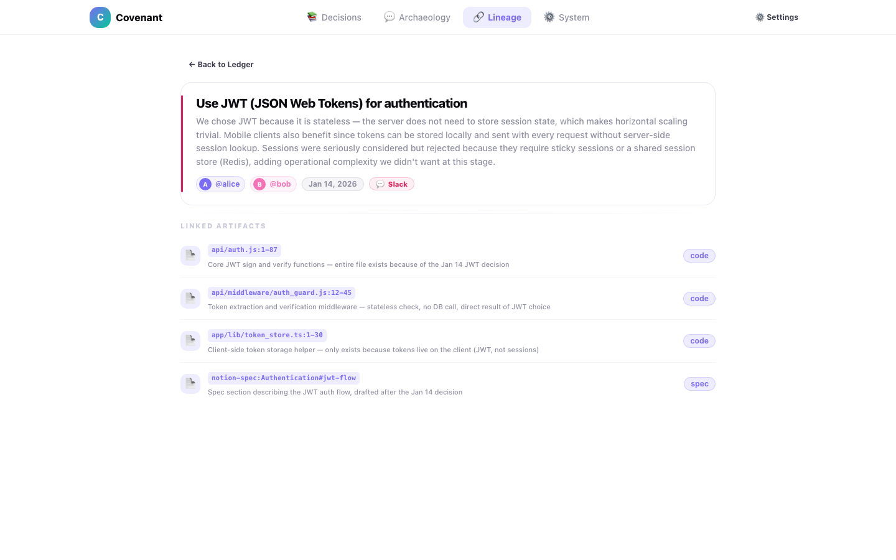
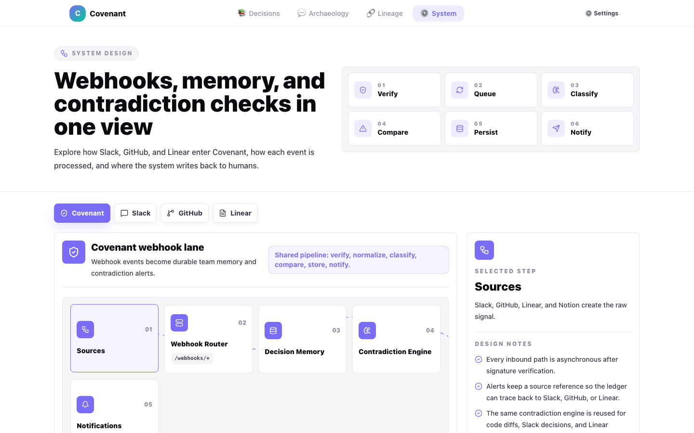

<div align="center">

# 🛡️ Covenant

**Your team made promises. Covenant makes sure the code keeps them.**

Covenant watches your Slack, Notion, GitHub, and Linear. The moment code contradicts a past decision — it says so, in the PR, in real time.

[](https://fastapi.tiangolo.com)
[](https://nextjs.org)
[](https://openai.com)
[](https://supabase.com)

</div>

---

## What is Covenant?

Teams make decisions in Slack threads, Notion pages, and GitHub PR comments — then forget them six months later. A new engineer swaps JWT for sessions. Someone rebuilds a 3-step checkout as one page. The original decision-makers are long gone.

Covenant connects the dots in real time:

1. **Ingests** decisions from Slack, Notion, GitHub, and Linear
2. **Embeds** them into a vector database (Supabase + pgvector)
3. **Watches** every commit diff and Slack message for contradictions
4. **Posts** a GitHub PR comment within 30 seconds — citing the original decision, the date, and who made it

---

## Screenshots

### Hero — Live, watching your repo now



A dark, animated landing with Slack, Notion, GitHub, and Linear orbiting a central shield. The animated typewriter cycles through "breaks its own promises", "forgets its own decisions", "ignores its own past."

---

### Interactive Demo — Watch a broken promise get caught



Click **"▶ Push commit & watch"** and five pipeline stages light up one by one — Commit pushed → Webhook received → Diff extracted → AI checking → Contradiction found. All five complete with checkmarks in under 5 seconds.

---

### Promise Check — The PR comment Covenant posts



When a contradiction is detected, Covenant posts a structured comment to the GitHub commit — referencing the exact past decision, the participants who made it, and the date. A severity badge (`Structural`, `Behavioural`, or `Cosmetic`) and a confidence score accompany each flag. The Alert Banner simultaneously slides into the web UI.

---

### Decision Ledger — Team memory, ready for review



A filterable card grid of all recorded decisions — sourced from Slack (pink), Notion (green), GitHub (blue), and Linear (orange). The alert banner slides in when a live contradiction is detected, citing the commit hash, violated decision, and participants.

---

### Archaeology — Ask why the codebase looks the way it does



A chat interface backed by GPT-4o and vector search. Ask natural-language questions like "Why are we using JWT?" or "Why is checkout 3 steps?" and Covenant narrates the decision — who made it, when, and why the alternatives were rejected.

---

### Lineage — Trace a decision to its artifacts



Every decision links to the files, routes, and packages it governs. The lineage view shows the full decision detail card plus a list of linked artifacts — giving engineers instant context on why code looks the way it does.

---

### System Design — How it all fits together



An interactive breakdown of the four pipeline lanes — Sources, Webhook Router, Decision Memory, Contradiction Engine, and Notifications — with design notes explaining the asynchronous-first architecture.

---

## Architecture

```
Slack / Notion / GitHub / Linear
         │
         ▼  (webhook or poller)
   FastAPI Backend
         │
         ├─ Signature verification
         ├─ Background task (< 3s response guarantee)
         │
         ├─► Classifier (gpt-4o-mini) — is this a decision?
         ├─► Embedder (text-embedding-3-small, 1536d) → Supabase pgvector
         └─► Contradiction detector (gpt-4o)
                   │
                   ├─► GitHub commit comment
                   ├─► Slack thread reply
                   └─► UI alert (Next.js polling /api/alerts)
```

**Key design choices:**

| Choice | Reason |
|---|---|
| Every webhook returns 200 in < 3s | Slack and GitHub retry aggressively; heavy work goes to `BackgroundTasks` |
| `MODE=DEMO` cache | Stage demo works even if the live pipeline hiccups |
| pgvector for decisions | Semantic match is more reliable than keyword search for contradiction detection |
| gpt-4o-mini for classification | Speed + cost; contradiction detection (the harder task) uses gpt-4o |
| Confidence threshold 0.7 | Reduces false positives; `contradicts: false` below threshold |

---

## Project Layout

```
covenant/
├── agent/
│   ├── classifier.py       # DECISION / DISCUSSION / NOISE — gpt-4o-mini
│   ├── contradiction.py    # find_contradictions() — gpt-4o, concurrent
│   └── archaeology.py      # answer_archaeology() — canned-first, then RAG
│
├── api/
│   ├── main.py             # FastAPI app, CORS, routers, startup
│   ├── db.py               # Supabase data layer
│   ├── demo_cache.py       # MODE=DEMO short-circuit (no OpenAI calls)
│   └── routes/
│       ├── webhooks.py     # /webhooks/{github,slack,linear}
│       ├── decisions.py    # GET /api/decisions, /api/decisions/{id}/lineage
│       ├── alerts.py       # GET /api/alerts?since=<ts>
│       ├── check.py        # POST /api/check
│       └── archaeology.py  # POST /api/archaeology
│
├── adapters/
│   ├── github.py           # verify_signature, get_diff, post_commit_comment
│   ├── slack.py            # post_slack_reply
│   ├── notion.py           # async poller (60s interval)
│   └── linear.py           # webhook handler
│
├── scripts/
│   ├── schema.sql          # Supabase tables + match_decisions() pgvector fn
│   └── seed.py             # Load decisions.json → embed → upsert
│
├── data/
│   ├── decisions.json      # 10 seed decisions (locked)
│   ├── slack_export.json   # Sample Slack messages (locked)
│   ├── lineage_links.json  # Decision → artifact mappings (locked)
│   └── archaeology_canned.json  # Canned Q&A for demo (locked)
│
└── web/                    # Next.js 14 frontend
    ├── app/
    │   ├── page.tsx        # Decision Ledger
    │   ├── archaeology/    # Chat interface
    │   ├── lineage/        # Artifact trace view
    │   └── system-design/  # Architecture explorer
    └── components/
        ├── Hero.tsx
        ├── LiveDemo.tsx
        ├── DecisionLedger.tsx
        ├── DecisionCard.tsx
        ├── AlertBanner.tsx
        ├── ArchaeologyChat.tsx
        └── LineageView.tsx
```

---

## Getting Started

### Prerequisites

- Python 3.11+
- Node.js 18+
- A Supabase project with pgvector enabled
- OpenAI API key
- GitHub webhook (push events) pointed at your server
- (Optional) Slack bot, Notion integration, Linear webhook

### Backend

```bash
# 1. Install Python dependencies
pip install -r requirements.txt

# 2. Copy and fill environment variables
cp .env.example .env

# 3. Create Supabase schema and load seed data
# Run scripts/schema.sql in the Supabase SQL editor, then:
python scripts/seed.py

# 4. Start the API
uvicorn api.main:app --reload --port 8000
```

### Frontend

```bash
cd web
npm install
npm run dev
# → http://localhost:3000
```

### Environment variables

```env
# OpenAI
OPENAI_API_KEY=sk-...

# Supabase
SUPABASE_URL=https://xyz.supabase.co
SUPABASE_SERVICE_KEY=eyJ...

# GitHub
GITHUB_TOKEN=ghp_...
GITHUB_WEBHOOK_SECRET=your-secret
GITHUB_REPO=owner/repo

# Slack (optional)
SLACK_BOT_TOKEN=xoxb-...

# Notion (optional)
NOTION_TOKEN=secret_...
NOTION_DATABASE_ID=...

# Linear (optional)
LINEAR_WEBHOOK_SECRET=...

# Demo mode (skip OpenAI calls for known demo commits)
MODE=DEMO

# Frontend
NEXT_PUBLIC_API_URL=http://localhost:8000
NEXT_PUBLIC_USE_MOCK=0   # set to 1 for local dev without a backend
```

---

## The Demo Flow

The one thing that must work: **push a commit → PR comment in < 30 seconds.**

```bash
# Push the violation commit
git apply data/demo-commits/001-session-auth.patch
git commit -am "switch to session-based auth"
git push

# Within 30 seconds, the commit gets a GitHub comment:
# "🛡️ Covenant — Promise Check
#  Past decision (Jan 14, 2025, @alice @bob):
#  Use JWT for all auth. Stateless, works for mobile, no shared session store.
#  Severity: structural · Confidence: 96%"

# Push the clean commit — no comment posted
git apply data/demo-commits/002-no-violation.patch
git commit -am "minor refactor"
git push
```

With `MODE=DEMO` set, the contradiction path returns cached results for the two known demo commits without calling OpenAI — guaranteed to work on stage.

---

## Contradiction Severity Guide

| Severity | Meaning | Example |
|---|---|---|
| **Structural** | Fundamentally different approach | JWT → sessions, REST → GraphQL |
| **Behavioural** | Same shape, different logic | Validation timing, retry strategy |
| **Cosmetic** | Label or naming change, no functional impact | Renaming a function |

Confidence below 0.7 → `contradicts: false`. Covenant is conservative by design.

---

## Tech Stack

| Layer | Technology |
|---|---|
| LLM | OpenAI GPT-4o (contradiction/archaeology), GPT-4o-mini (classification) |
| Embeddings | text-embedding-3-small (1536 dims) |
| Vector store | Supabase + pgvector |
| Backend | FastAPI (Python), async, BackgroundTasks |
| Frontend | Next.js 14 (App Router), TypeScript, Tailwind CSS |
| Webhooks | GitHub push events, Slack Event API, Linear webhooks |
| Polling | Notion API (60s interval) |

---

<div align="center">

Built at **OpenAI × Sea Hackathon** · *Build the money moment, prove it once, cache it.*

</div>
